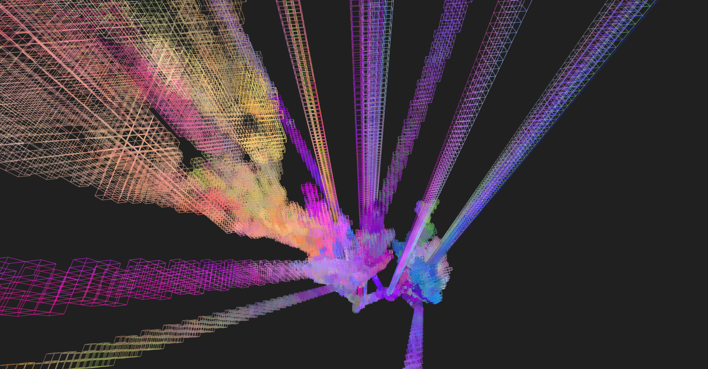

# automata

* arbitrary self-replicating machines running on arbitrary topologies
* continuous or discrete spaces, arbitrary number of dimensions, graph structures, hexagonal grids, etc
* machines can be stohastic or deterministic, behaviour implemented as RAM-machines, generative grammars, blind or with perception, etc 
 
should be able to simulate transformation rule based generation like L-systems, brownian motion etc or stuff that perceves, like CA or boids

spaces are immutable objects, machines are functions returning other machines potentially with their location transformed.

views, storage and controllers are implemented as plugins

## Deterministic L-systems

```livescript
  A = (ctx) -> ctx.t x: -2, s: (/2),(ctx) ->
      ctx.t r: -60 , x: 1, (ctx) -> return
        B
        ctx.t r: 60, x: 1, (ctx) -> return
          A
          ctx.t r: 60, x: 1, (ctx) -> return
            B

  B = (ctx) -> ctx.t x: -2, s: (/2), (ctx) ->
      ctx.t r: 60, x: 1, (ctx) -> return
        A
        ctx.t r: -60, x: 1, (ctx) -> return
          B
          ctx.t r: -60, x: 1, (ctx) -> return
            A
```            

## Stohastic L-systems
### 3D

```livescript
mover = (pos, ctx) -> pos + (random(-mapper(1 - ctx.ctx.size), mapper(1 - ctx.ctx.size), true))
export Branch = (ctx) ->
  ctx.t do
    size: (* 0.9)
    x: mover
    y: mover
    z: mover
    -> weighted do
      [ 1, [ Branch, Branch ] ]
      [ 4, Branch ]
```


```livescript
export Branch = (ctx) ->
  ctx.t { dir: mover, size: (*0.96), color: rndc }, (ctx) ->
    weighted do
      [ 2 / ctx.ctx.size, Branch ]
      [ 1, [ Branch, Branch ] ]
```

## CA
game of life, R-Pentomino pattern


```livescript
placeChecks = (ctx) ->
  map ctx.neighCoords(), (coords) ->
    if not ctx.lookFuture(coords)
      ctx.t { loc: coords } <<< rndcBlock, (ctx) -> Check

export On = (ctx) ->
  if ctx.count(On) in [ 2, 3 ] then ctx.t rndcBlock, (ctx) -> [ On ]
  else placeChecks(ctx)
      
export Check = (ctx) ->
  if ctx.count(On) == 3 then [ On, ...placeChecks(ctx) ]
```
